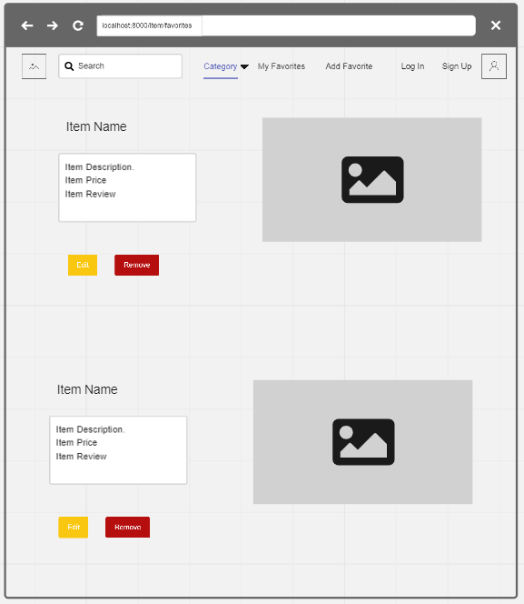
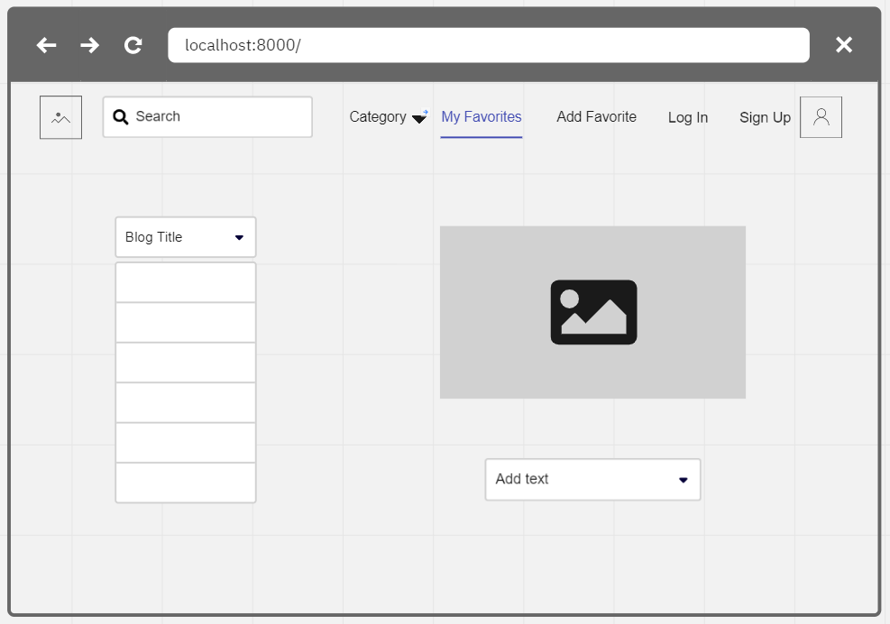
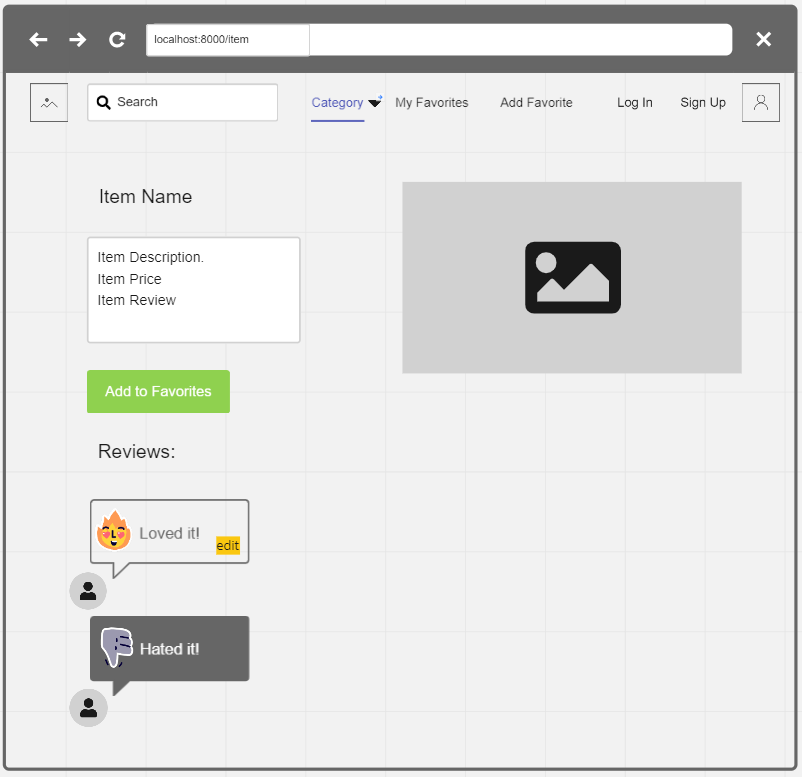
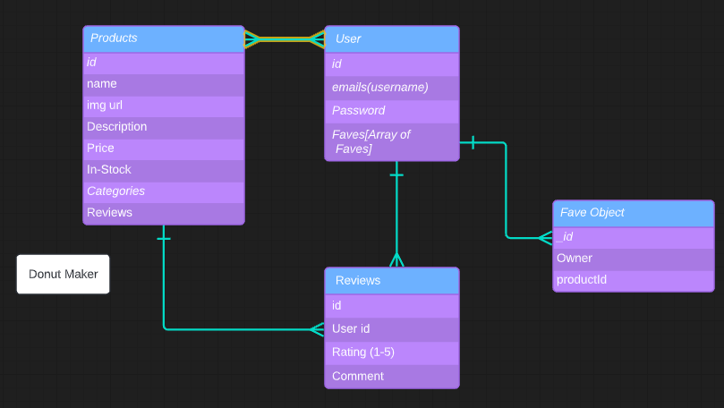

# Title : Winter Spaceship

1. The website will open that shows our Blog title with an index of all of our product recommendations. 

2. There will be a Nav Bar with a search bar, a category section, a favorites section and Log in and Sign up link. 

3. You will be able to click on the item and it will take you the show page which will have the description, the price, the image and reviews. The reviews will be featured underneath the item description. It will have an add to favorites button as well. 

4. The reviews will be able to be edited by the respective owner.

5. The favorites(wishlist) page wil feature all of the items the user has added to their favorites list. The user will be able to scroll through their favorites and see the product information and image. They will be able to edit and delete items from  their personal wishlist. 

6. Lastly, there will be a category nav-bar that will allow the user to search for specific items by category.

Technologies Used: React, Bootstrap, JavaScript

MVP: Full CRUD 

Stretch Goals: Sort by Price 

Link to the API-matching GitHub:
[333-api](https://github.com/oliviawilcox1/333-api)

WireFrames

ERD

